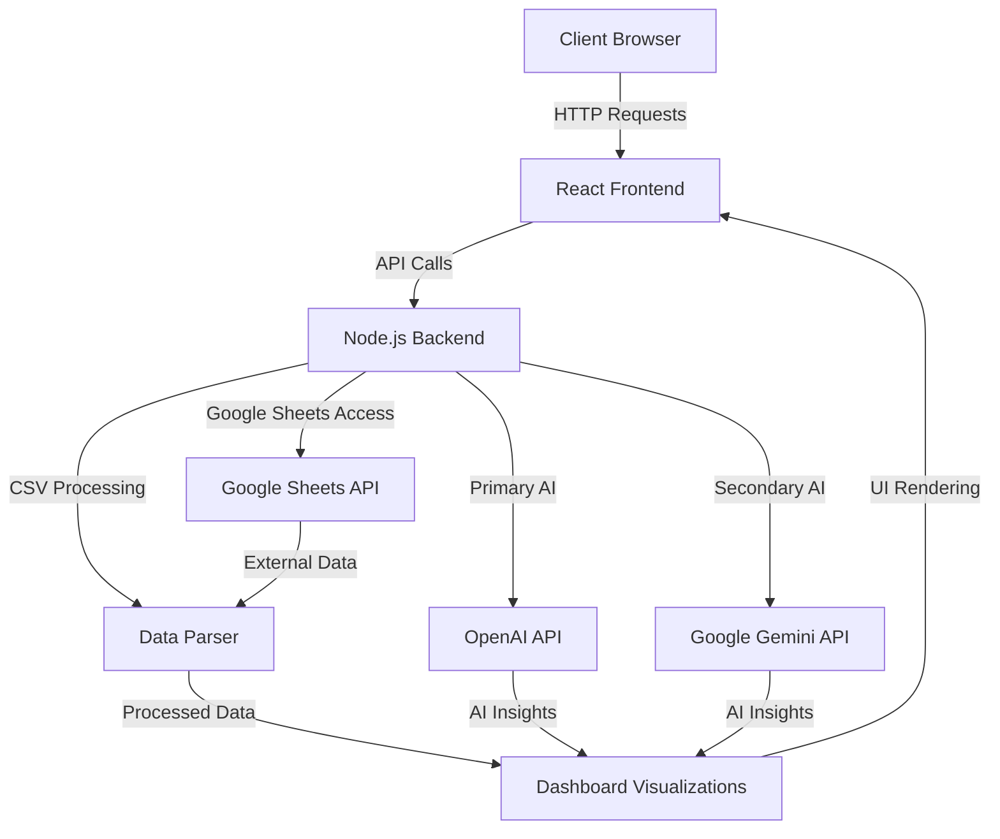

<div align="center">

# 🏥 EHR MC Dashboard 📊

[](https://github.com/SquizAI/EHR_MC_Dashboard/stargazers)
[](https://github.com/SquizAI/EHR_MC_Dashboard/network/members)
[](https://github.com/SquizAI/EHR_MC_Dashboard/issues)
[](https://github.com/SquizAI/EHR_MC_Dashboard/blob/main/LICENSE)

<p align="center">
  
</p>

_A powerful dashboard for healthcare analytics, with AI-driven insights for Electronic Health Records and Medical Conversations_

[Features](#-features) • [Demo](#-live-demo) • [Technology](#-technology) • [Getting Started](#-getting-started) • [Usage](#-usage) • [Roadmap](#-roadmap) • [Contributing](#-contributing) • [License](#-license)

</div>

## 🌟 Features

<div align="center">
<table>
<tr>
<td width="50%">

### 📋 Data Integration
- Upload EHR/conversation data from CSV files
- Automatic mapping of funnel stages
- Support for various healthcare data formats
- Smart data sampling for large datasets

### 🤖 AI-Powered Analysis
- Dual AI provider support (OpenAI and Google Gemini)
- Automatic failover between AI providers
- Pattern recognition in patient journeys
- Actionable recommendations with A2A protocol support
- Smart data sampling for efficient AI analysis

</td>
<td width="50%">

### 📊 Interactive Visualizations
- Conversion funnel analysis
- Channel performance comparison
- Treatment efficacy metrics
- Patient segment analysis

### 📱 Modern UI/UX
- Responsive Material UI design
- Dark/light theme support
- Customizable dashboard layouts
- Mobile-optimized views

</td>
</tr>
</table>
</div>

<p align="center">
  
</p>

## 🚀 Live Demo

Explore the dashboard with sample data: [EHR MC Dashboard Demo](https://ehr-mc-dashboard.netlify.app)

## 🔧 Technology

<div align="center">

[](https://reactjs.org/)
[](https://vitejs.dev/)
[](https://mui.com/)
[](https://www.chartjs.org/)
[](https://nodejs.org/)
[](https://expressjs.com/)
[](https://openai.com/)
[](https://ai.google.dev/)

</div>

### Architecture



## 📦 Getting Started

### Prerequisites

- Node.js (v16 or higher)
- OpenAI API Key (for GPT-4o)
- Google Gemini API Key (optional, for Gemini 2.5 Pro)
- Google Sheets API credentials (optional, for direct sheets integration)

### Installation

1. **Clone the repository**
   ```bash
   git clone https://github.com/SquizAI/EHR_MC_Dashboard.git
   cd EHR_MC_Dashboard
   ```

2. **Install frontend dependencies**
   ```bash
   npm install
   ```

3. **Install backend dependencies**
   ```bash
   cd server
   npm install
   cd ..
   ```

4. **Set up environment variables**
   ```bash
   cp .env.example .env
   ```
   Edit `.env` file and add your API keys:
   ```
   OPENAI_API_KEY=your_openai_api_key_here
   GEMINI_API_KEY=your_gemini_api_key_here
   AI_PROVIDER=openai  # or 'gemini' to set default provider
   GOOGLE_APPLICATION_CREDENTIALS=path/to/google_credentials.json  # optional, for Google Sheets API
   ```

### Running the Application

1. **Start the backend server**
   ```bash
   npm run server
   ```

2. **Start the frontend development server**
   ```bash
   npm run dev
   ```

3. **Open your browser**
   Navigate to: http://localhost:5173

## 📈 Usage

<div align="center">
  
</div>

1. **Upload Data**: Import your healthcare data in CSV format
2. **Review Data**: Verify the uploaded information in the preview table
3. **Generate Insights**: Click 'Generate Insights' to analyze data with AI
4. **Explore Metrics**: Navigate through various dashboard components:
   - Conversion Funnel Analysis
   - Channel Performance
   - Patient Demographics
   - Treatment Efficiency
5. **Export & Share**: Download reports or share insights with your team

### Data Format

The dashboard works best with CSV files containing these fields:

| Field | Description | Example |
|-------|-------------|--------|
| `patient_id` | Unique identifier | P12345 |
| `stage` | Patient funnel stage | Awareness, Consideration, Decision |
| `source` | Acquisition channel | Referral, Website, Insurance |
| `timestamp` | Event date/time | 2023-04-15T14:30:00Z |
| `treatment` | Treatment type | Consultation, Procedure, Follow-up |
| `outcome` | Treatment result | Completed, Referred, Cancelled |

<details>
<summary>Show sample CSV format</summary>

```csv
patient_id,stage,source,timestamp,treatment,outcome
P12345,Awareness,Website,2023-04-15T14:30:00Z,Consultation,Completed
P12346,Consideration,Referral,2023-04-16T09:15:00Z,Procedure,Completed
P12347,Decision,Insurance,2023-04-17T11:00:00Z,Follow-up,Cancelled
```
</details>

## 🗺️ Roadmap

- [ ] **Enhanced AI Analysis**
  - Predictive analytics for patient outcomes
  - Sentiment analysis of patient feedback
  - Automated reporting with key insights

- [ ] **Advanced Visualizations**
  - 3D visualization of patient journeys
  - Geographical distribution maps
  - Custom chart builder

- [ ] **Integration Capabilities**
  - Direct EHR system connections
  - Real-time data streaming
  - Multi-source data synchronization

## 👥 Contributing

We welcome contributions! Please follow these steps:

1. Fork the repository
2. Create your feature branch (`git checkout -b feature/AmazingFeature`)
3. Commit your changes (`git commit -m 'Add some AmazingFeature'`)
4. Push to the branch (`git push origin feature/AmazingFeature`)
5. Open a Pull Request

<details>
<summary>Development Guidelines</summary>

- Follow the existing code style
- Write unit tests for new features
- Update documentation as needed
- Follow conventional commit messages
</details>

## 📄 License

This project is licensed under the MIT License - see the [LICENSE](LICENSE) file for details.

---

<div align="center">

**Made with ❤️ by [SquizAI](https://github.com/SquizAI)**

[Report Bug](https://github.com/SquizAI/EHR_MC_Dashboard/issues) • [Request Feature](https://github.com/SquizAI/EHR_MC_Dashboard/issues)

</div>
